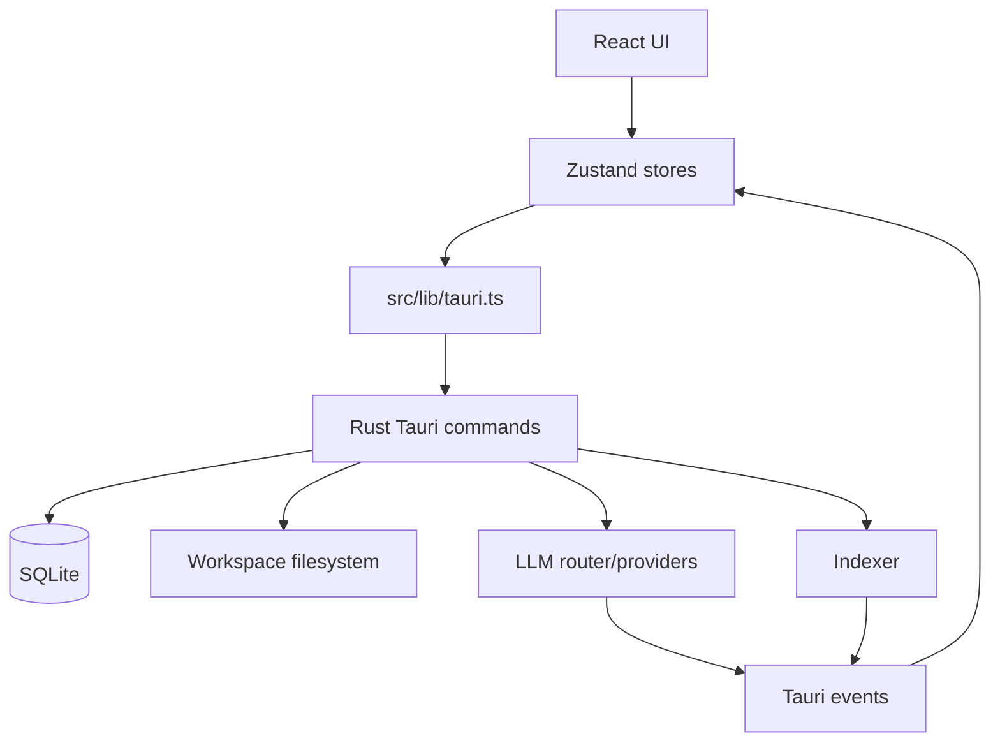

# Architecture

This document satisfies the single-file architecture entry point requested for the repository. The maintained source of truth is split into focused files:

- [System overview](overview.md)
- [Frontend architecture](frontend.md)
- [Backend architecture](backend.md)
- [Database architecture](database.md)
- [Infrastructure](infrastructure.md)

## System Overview

Open Atelier is a local-first Tauri desktop AI workspace. React runs in the renderer, Rust runs in the Tauri main process, and SQLite stores local application data ([src/main.tsx](../../src/main.tsx#L7), [src-tauri/src/lib.rs](../../src-tauri/src/lib.rs#L20), [src-tauri/src/db/mod.rs](../../src-tauri/src/db/mod.rs#L8)).

## Architectural Patterns

- Renderer/main process split through Tauri `invoke` and events ([src/lib/tauri.ts](../../src/lib/tauri.ts#L10), [src/hooks/useTauriEvents.ts](../../src/hooks/useTauriEvents.ts#L21)).
- Local-first persistence through SQLite and workspace files ([src-tauri/src/db/schema.rs](../../src-tauri/src/db/schema.rs#L6), [src-tauri/src/commands/files.rs](../../src-tauri/src/commands/files.rs#L18)).
- BYOK/provider routing in Rust ([src-tauri/src/llm/router.rs](../../src-tauri/src/llm/router.rs#L31)).
- Background work by spawned async tasks and Tauri events, not a durable queue ([src-tauri/src/commands/files.rs](../../src-tauri/src/commands/files.rs#L175), [src-tauri/src/commands/chat.rs](../../src-tauri/src/commands/chat.rs#L183)).

## Module Dependency Map

## Data Flow Diagrams

Chat streaming and indexing diagrams are maintained in [overview.md](overview.md#data-flow-diagrams).

## Request Lifecycle

React mounts `App`, stores call wrappers in `src/lib/tauri.ts`, Rust commands validate inputs and update SQLite/files/providers, and long-running work reports back over Tauri events ([src/App.tsx](../../src/App.tsx#L47), [src/lib/tauri.ts](../../src/lib/tauri.ts#L10), [src-tauri/src/lib.rs](../../src-tauri/src/lib.rs#L77), [src/hooks/useTauriEvents.ts](../../src/hooks/useTauriEvents.ts#L21)).

## Authentication Flow

No app account authentication is implemented. Provider access is BYOK/local CLI session reuse, while workspace/file authorization is enforced by path validation under the active profile/workspace roots ([docs/reference/source-records/architecture/development-reference.md](../reference/source-records/architecture/development-reference.md#L5), [src-tauri/src/commands/cred_store.rs](../../src-tauri/src/commands/cred_store.rs#L1), [src-tauri/src/commands/workspace.rs](../../src-tauri/src/commands/workspace.rs#L45), [src-tauri/src/commands/files.rs](../../src-tauri/src/commands/files.rs#L18)).

## Database Relationships

The core relationships are profiles to workspaces, workspaces to files/conversations, files to chunks, conversations to messages, and messages/chunks/files to citations. The authoritative schema is [src-tauri/src/db/schema.rs](../../src-tauri/src/db/schema.rs#L6), with relationship documentation in [database.md](database.md).

## Background Jobs And Queues

No durable queue implementation was found. Indexing and chat streaming use spawned async tasks and emit `index://*` and `chat://*` events ([src-tauri/src/commands/files.rs](../../src-tauri/src/commands/files.rs#L186), [src-tauri/src/commands/chat.rs](../../src-tauri/src/commands/chat.rs#L183), [src/hooks/useTauriEvents.ts](../../src/hooks/useTauriEvents.ts#L21)).

## External Services

Provider modules reference OpenAI, Anthropic, Google Gemini, Ollama, Apple FM sidecar, OpenAI-compatible vendors, and CLI credential/session helpers ([src-tauri/src/llm/openai.rs](../../src-tauri/src/llm/openai.rs#L37), [src-tauri/src/llm/anthropic.rs](../../src-tauri/src/llm/anthropic.rs#L40), [src-tauri/src/llm/google.rs](../../src-tauri/src/llm/google.rs#L41), [src-tauri/src/llm/ollama.rs](../../src-tauri/src/llm/ollama.rs#L21), [src-tauri/src/llm/apple.rs](../../src-tauri/src/llm/apple.rs#L41), [src-tauri/src/llm/openai_compatible.rs](../../src-tauri/src/llm/openai_compatible.rs#L90), [src-tauri/src/commands/cli_detect.rs](../../src-tauri/src/commands/cli_detect.rs#L28)).

## Deployment Architecture

Open Atelier is packaged as a Tauri desktop app. Tauri config points development at Vite on port `1420`, builds from `dist`, and bundles desktop artifacts; CI and release workflows build on macOS and Ubuntu ([src-tauri/tauri.conf.json](../../src-tauri/tauri.conf.json#L5), [.github/workflows/ci.yml](../../.github/workflows/ci.yml#L10), [.github/workflows/release.yml](../../.github/workflows/release.yml#L10)).
