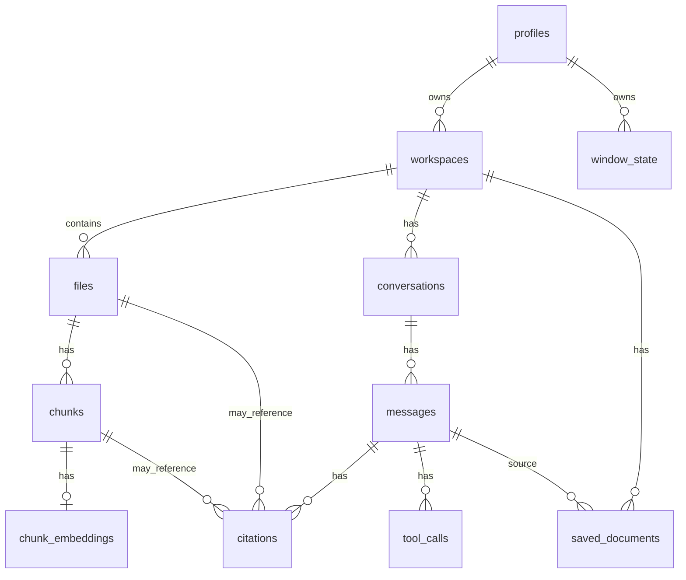

# Database Architecture

## Storage Location And Connection

The application opens SQLite at `<app_data>/atelier.db` during Tauri setup ([src-tauri/src/lib.rs](../../src-tauri/src/lib.rs#L20)). Connections are wrapped as `Arc<Mutex<Connection>>` ([src-tauri/src/db/mod.rs](../../src-tauri/src/db/mod.rs#L8)). The connection enables foreign keys, WAL mode, and a 5000ms busy timeout ([src-tauri/src/db/mod.rs](../../src-tauri/src/db/mod.rs#L12)).

## Migration Model

The schema is applied as a single `CREATE TABLE IF NOT EXISTS` script ([src-tauri/src/db/mod.rs](../../src-tauri/src/db/mod.rs#L26), [src-tauri/src/db/schema.rs](../../src-tauri/src/db/schema.rs#L1)). Defensive `ALTER TABLE` calls add `messages.input_tokens`, `messages.output_tokens`, `messages.display_override`, and `workspaces.parent_workspace_id` for older databases and ignore duplicate-column errors ([src-tauri/src/db/mod.rs](../../src-tauri/src/db/mod.rs#L30)).

`workspaces.parent_workspace_id` is a nullable self-reference (`ON DELETE SET NULL`) making a workspace a sub-project of another, one level deep. Sub-projects share context with their parent in both directions via each workspace's own `context.md`, not through any DB-level content merge — see `build_related_context` in [src-tauri/src/commands/chat.rs](../../src-tauri/src/commands/chat.rs#L60).

`messages.content` always holds the model's raw, unedited output (or the user's raw input) — it doubles as the conversation history fed back to the model on future turns, so it must never contain fabricated text. `messages.display_override`, when non-null, is a synthesized confirmation shown to the user instead (e.g. for a turn that was all triggers and no chat text) without ever being persisted into `content` or replayed to the model ([src-tauri/src/commands/chat.rs](../../src-tauri/src/commands/chat.rs#L173)).

## Core Tables

- `profiles`: local user/profile folders and active profile flag ([src-tauri/src/db/schema.rs](../../src-tauri/src/db/schema.rs#L6)).
- `workspaces`: projects under a profile, path/name/index status/settings ([src-tauri/src/db/schema.rs](../../src-tauri/src/db/schema.rs#L25)).
- `files`: indexed file metadata per workspace ([src-tauri/src/db/schema.rs](../../src-tauri/src/db/schema.rs#L37)).
- `chunks`: text chunks extracted from files ([src-tauri/src/db/schema.rs](../../src-tauri/src/db/schema.rs#L57)).
- `chunks_fts`: FTS5 virtual table backed by `chunks` ([src-tauri/src/db/schema.rs](../../src-tauri/src/db/schema.rs#L74)).
- `chunk_embeddings`: JSON embedding fallback storage ([src-tauri/src/db/schema.rs](../../src-tauri/src/db/schema.rs#L147)).
- `conversations` and `messages`: chat state, provider/model, token usage, and status ([src-tauri/src/db/schema.rs](../../src-tauri/src/db/schema.rs#L94)).
- `citations`: references from messages to chunks/files ([src-tauri/src/db/schema.rs](../../src-tauri/src/db/schema.rs#L124)).
- `tool_calls`: proposed tool calls and approval status ([src-tauri/src/db/schema.rs](../../src-tauri/src/db/schema.rs#L153)).
- `saved_documents`: saved assistant outputs ([src-tauri/src/db/schema.rs](../../src-tauri/src/db/schema.rs#L139)).
- `window_state`: table exists, but no inspected command writes/reads it; usage is uncertain ([src-tauri/src/db/schema.rs](../../src-tauri/src/db/schema.rs#L16)).
- `app_settings`: created lazily by settings commands, not in the main schema script ([src-tauri/src/commands/settings.rs](../../src-tauri/src/commands/settings.rs#L123)).

## Relationships

## FTS Maintenance

`chunks_fts` is synchronized with `chunks` through insert, delete, and update triggers ([src-tauri/src/db/schema.rs](../../src-tauri/src/db/schema.rs#L81)).

## Search Path

`search_hybrid` queries FTS5/BM25, calculates reciprocal-rank-fusion-style scores for BM25 results, and returns citation-like search results ([src-tauri/src/commands/chat.rs](../../src-tauri/src/commands/chat.rs#L327)). Although embeddings are stored by the indexer, vector rank contribution is currently omitted in `search_hybrid` ([src-tauri/src/commands/chat.rs](../../src-tauri/src/commands/chat.rs#L348)).

## Data Ownership Rules

- `profiles.root_path` is unique ([src-tauri/src/db/schema.rs](../../src-tauri/src/db/schema.rs#L10)).
- `workspaces.path` is unique ([src-tauri/src/db/schema.rs](../../src-tauri/src/db/schema.rs#L28)).
- `files` are unique by `(workspace_id, rel_path)` ([src-tauri/src/db/schema.rs](../../src-tauri/src/db/schema.rs#L50)).
- Foreign keys generally cascade from parent records to child records; citations and saved documents set optional file/message references to null where configured ([src-tauri/src/db/schema.rs](../../src-tauri/src/db/schema.rs#L124)).

## Known Limitations

- There is no formal migration version table in the inspected files.
- `app_settings` is created lazily outside `schema.rs`; this is verified in settings commands, not the schema file ([src-tauri/src/commands/settings.rs](../../src-tauri/src/commands/settings.rs#L127)).
- Embeddings are stored, but vector search is not currently used in ranking ([src-tauri/src/commands/chat.rs](../../src-tauri/src/commands/chat.rs#L364)).
