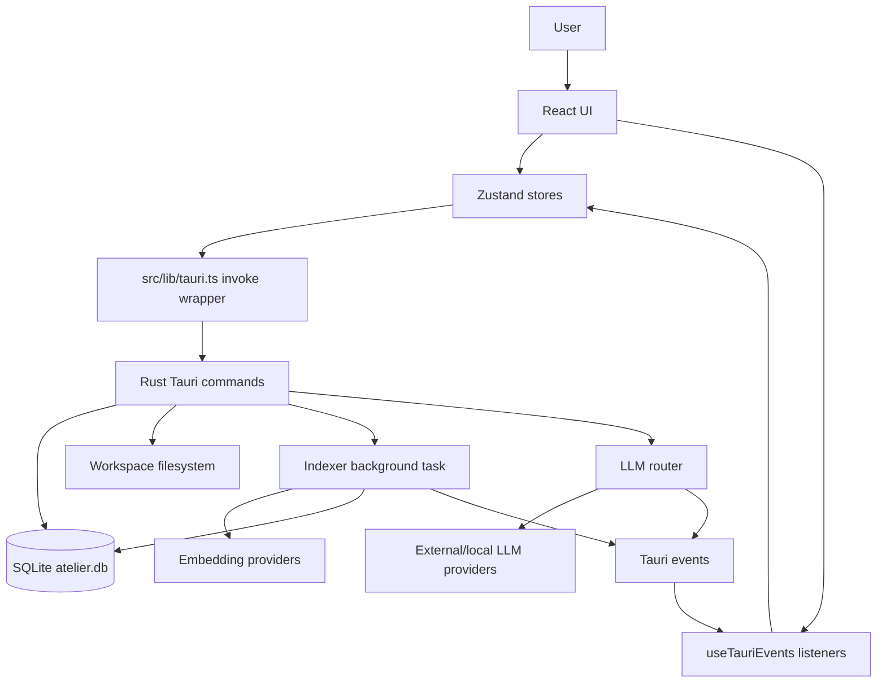
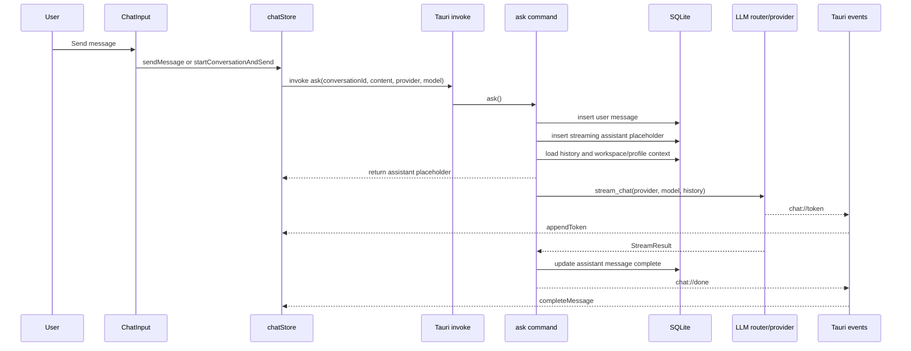
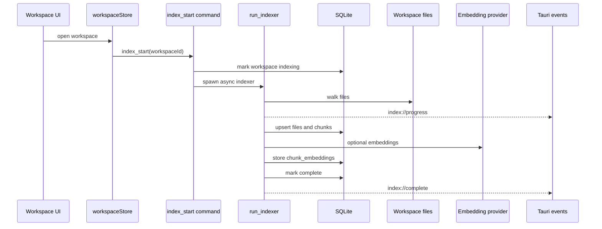
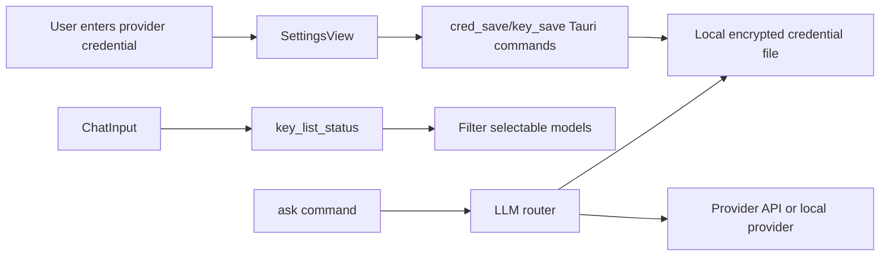
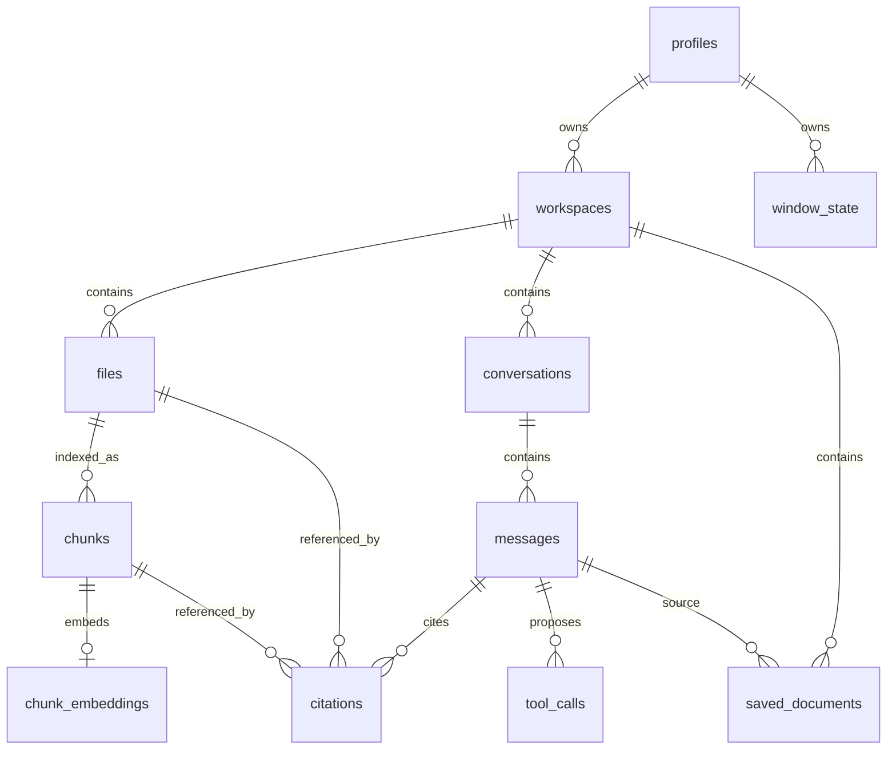

# Architecture Overview

## System Overview

Open Atelier is a local-first desktop AI workspace. Users open a folder and chat with documents while data stays on the local machine. The implementation is a Tauri desktop app: React runs in the renderer process, Rust runs in the Tauri main process, and SQLite is stored on disk ([docs/reference/source-records/architecture/development-reference.md](../reference/source-records/architecture/development-reference.md#L29), [src-tauri/src/lib.rs](../../src-tauri/src/lib.rs#L20)).

The user-facing application is organized around profiles, workspaces, files, conversations, AI providers, and settings. Frontend state lives in Zustand stores ([src/stores/profileStore.ts](../../src/stores/profileStore.ts#L5), [src/stores/workspaceStore.ts](../../src/stores/workspaceStore.ts#L5), [src/stores/chatStore.ts](../../src/stores/chatStore.ts#L5), [src/stores/uiStore.ts](../../src/stores/uiStore.ts#L4)). Backend behavior is exposed through Tauri commands registered in one command handler ([src-tauri/src/lib.rs](../../src-tauri/src/lib.rs#L77)).

## Architectural Patterns

- Desktop shell pattern: Tauri owns native app setup, plugins, menu, DB initialization, and command registration ([src-tauri/src/lib.rs](../../src-tauri/src/lib.rs#L15)).
- Renderer/main split: React calls Rust through Tauri `invoke`; Rust emits events for long-running operations and streaming responses ([src/lib/tauri.ts](../../src/lib/tauri.ts#L1), [src/hooks/useTauriEvents.ts](../../src/hooks/useTauriEvents.ts#L21)).
- Local-first persistence: app state and domain records are stored in local SQLite with WAL mode ([src-tauri/src/db/mod.rs](../../src-tauri/src/db/mod.rs#L10)).
- BYOK provider routing: provider/model selection is stored on conversations/messages and routed by a Rust LLM router ([src-tauri/src/llm/router.rs](../../src-tauri/src/llm/router.rs#L31)).
- Best-effort background processing: indexing runs in an async task and reports progress over Tauri events ([src-tauri/src/commands/files.rs](../../src-tauri/src/commands/files.rs#L175), [src-tauri/src/indexer/mod.rs](../../src-tauri/src/indexer/mod.rs#L82)).
- Path authorization over account authorization: workspace/file operations validate paths instead of checking app-user permissions because the app has no app-level auth system ([src-tauri/src/commands/workspace.rs](../../src-tauri/src/commands/workspace.rs#L45), [src-tauri/src/commands/files.rs](../../src-tauri/src/commands/files.rs#L18)).

## Module Dependency Map

Primary supporting files:

- React bootstrap: [src/main.tsx](../../src/main.tsx#L7)
- App composition: [src/App.tsx](../../src/App.tsx#L98)
- IPC wrapper: [src/lib/tauri.ts](../../src/lib/tauri.ts#L10)
- Tauri setup and command registration: [src-tauri/src/lib.rs](../../src-tauri/src/lib.rs#L15)
- DB schema: [src-tauri/src/db/schema.rs](../../src-tauri/src/db/schema.rs#L1)
- LLM router: [src-tauri/src/llm/router.rs](../../src-tauri/src/llm/router.rs#L31)
- Indexer: [src-tauri/src/indexer/mod.rs](../../src-tauri/src/indexer/mod.rs#L82)

## Data Flow Diagrams

### Chat Request And Streaming

This flow is implemented by [src/components/chat/ChatInput.tsx](../../src/components/chat/ChatInput.tsx#L80), [src/stores/chatStore.ts](../../src/stores/chatStore.ts#L109), [src-tauri/src/commands/chat.rs](../../src-tauri/src/commands/chat.rs#L101), and [src/hooks/useTauriEvents.ts](../../src/hooks/useTauriEvents.ts#L21).

### Workspace Indexing

This flow is implemented by [src/stores/workspaceStore.ts](../../src/stores/workspaceStore.ts#L43), [src-tauri/src/commands/files.rs](../../src-tauri/src/commands/files.rs#L175), and [src-tauri/src/indexer/mod.rs](../../src-tauri/src/indexer/mod.rs#L90).

## Request Lifecycle

1. React renders `App` inside `ErrorBoundary` ([src/main.tsx](../../src/main.tsx#L7)).
2. `App` loads profiles and enabled CLI providers, then loads workspaces for the active profile ([src/App.tsx](../../src/App.tsx#L47), [src/App.tsx](../../src/App.tsx#L53)).
3. UI actions call typed wrappers in `src/lib/tauri.ts`; wrappers call named Tauri commands ([src/lib/tauri.ts](../../src/lib/tauri.ts#L10)).
4. Rust commands validate inputs, access SQLite through `Db = Arc<Mutex<Connection>>`, read/write files, or route LLM calls ([src-tauri/src/db/mod.rs](../../src-tauri/src/db/mod.rs#L8)).
5. Long-running work returns immediately or emits events; the frontend listens through `useTauriEvents` ([src/hooks/useTauriEvents.ts](../../src/hooks/useTauriEvents.ts#L18)).

## Authentication Flow

There is no app account authentication or authorization service in the repository. The dev reference explicitly says "no auth" and "BYOK only" ([docs/reference/source-records/architecture/development-reference.md](../reference/source-records/architecture/development-reference.md#L5)).

Provider credential flow:

The local credential store never writes to the OS keychain and stores values in an encrypted local file under the app data directory ([src-tauri/src/commands/cred_store.rs](../../src-tauri/src/commands/cred_store.rs#L1)). macOS Keychain detection for external CLI OAuth sessions exists only as an explicit user-triggered check ([src-tauri/src/llm/anthropic_oauth.rs](../../src-tauri/src/llm/anthropic_oauth.rs#L86)).

Path authorization:

- Workspaces must be under the active profile root ([src-tauri/src/commands/workspace.rs](../../src-tauri/src/commands/workspace.rs#L45)).
- File commands canonicalize and validate paths under the workspace root ([src-tauri/src/commands/files.rs](../../src-tauri/src/commands/files.rs#L18)).

## Database Relationships

The schema is declared in [src-tauri/src/db/schema.rs](../../src-tauri/src/db/schema.rs#L6). See [database.md](database.md) for details.

## Background Jobs And Queues

There is no durable queue implementation in the repository. Background work is currently implemented as spawned async tasks:

- `index_start` spawns `run_indexer` with Tauri async runtime ([src-tauri/src/commands/files.rs](../../src-tauri/src/commands/files.rs#L186)).
- `ask` spawns a Tokio task to stream provider responses and later update SQLite ([src-tauri/src/commands/chat.rs](../../src-tauri/src/commands/chat.rs#L183)).
- Auto-title generation is a second LLM call after the first completed exchange ([src-tauri/src/commands/chat.rs](../../src-tauri/src/commands/chat.rs#L215)).

Uncertainty: there is no cancellation token wired to provider streaming. `cancelStreaming` updates frontend state only; no Rust cancellation command is registered for chat streams ([src/stores/chatStore.ts](../../src/stores/chatStore.ts#L211), [src-tauri/src/lib.rs](../../src-tauri/src/lib.rs#L77)).

## External Services

- OpenAI Chat Completions and Responses APIs ([src-tauri/src/llm/openai.rs](../../src-tauri/src/llm/openai.rs#L37)).
- Anthropic Messages API ([src-tauri/src/llm/anthropic.rs](../../src-tauri/src/llm/anthropic.rs#L40)).
- Google Gemini streamGenerateContent API ([src-tauri/src/llm/google.rs](../../src-tauri/src/llm/google.rs#L41)).
- Ollama local API (`/api/chat`, `/api/embed`) ([src-tauri/src/llm/ollama.rs](../../src-tauri/src/llm/ollama.rs#L21), [src-tauri/src/indexer/embedder.rs](../../src-tauri/src/indexer/embedder.rs#L63)).
- OpenAI-compatible providers: Groq, OpenRouter, Mistral, Together, DeepSeek ([src-tauri/src/llm/openai_compatible.rs](../../src-tauri/src/llm/openai_compatible.rs#L90)).
- Local CLI credential files for external coding CLIs (Codex CLI, Gemini CLI, etc.) ([src-tauri/src/commands/cli_detect.rs](../../src-tauri/src/commands/cli_detect.rs#L34)).
- Apple FM sidecar path is referenced, but no sidecar source or configured bundle resource was found in the inspected files; support is uncertain ([src-tauri/src/llm/apple.rs](../../src-tauri/src/llm/apple.rs#L41)).

## Deployment Architecture

Open Atelier is packaged as a Tauri desktop app, not deployed as a hosted service. Tauri config builds from `../dist`, uses dev URL `http://localhost:1420`, and bundles all targets with app icons ([src-tauri/tauri.conf.json](../../src-tauri/tauri.conf.json#L5), [src-tauri/tauri.conf.json](../../src-tauri/tauri.conf.json#L29)).

CI runs macOS and Ubuntu checks, then performs a debug Tauri build ([.github/workflows/ci.yml](../../.github/workflows/ci.yml#L10)). Release workflow builds tagged releases for macOS arm64/x64 and Linux x86_64 and uploads DMG/AppImage/DEB artifacts ([.github/workflows/release.yml](../../.github/workflows/release.yml#L10)).

Uncertainty: release workflow uploads artifacts but does not create a GitHub Release in the inspected file ([.github/workflows/release.yml](../../.github/workflows/release.yml#L55)).
